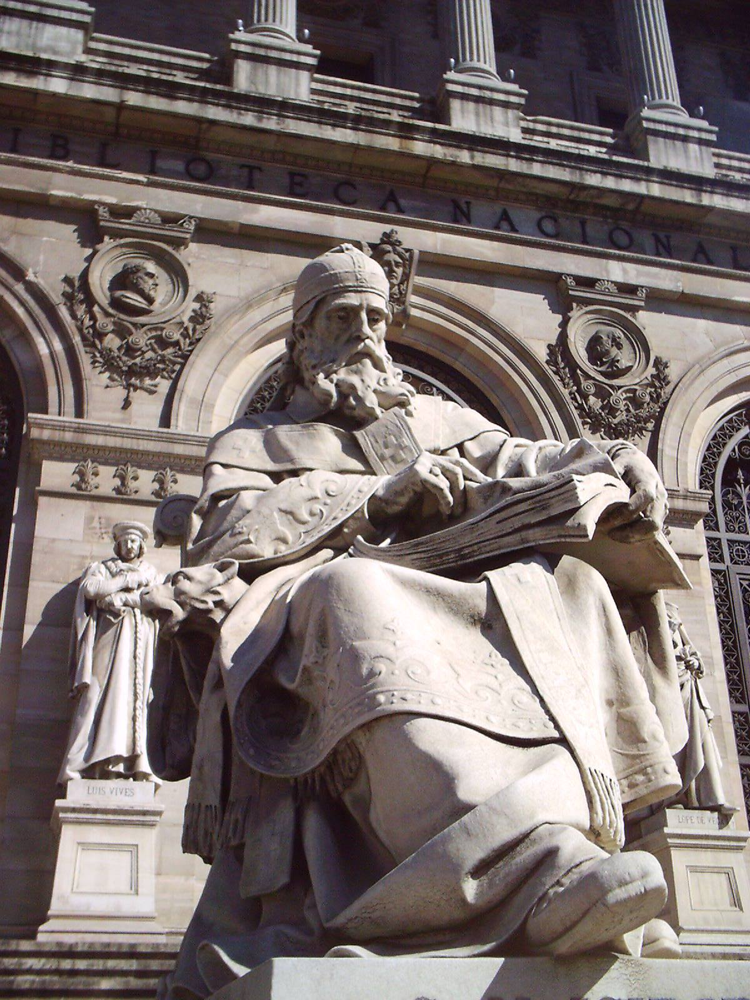

_Լուսանկարում՝ Սուրբ Իսիդոր Սևիլյացու հուշարձանն է Իսպանիայի ազգային գրադարանի մուտքի մոտ՝ Մադրիդում_

# Իսկ դուք գիտե՞ք, որ ծրագրավորողներն ունեն իրենց հովանավոր Սուրբը: Ո՞վ է Սուրբ Իսիդոր Սևիլյացին և ի՞նչ վաստակի համար է կաթոլիկ եկեղեցին նրան սրբադասել ու հռչակել ծրագրավորողների և համացանցից օգտվողների հովանավոր:

**_Իսիդոր Սևիլյացին_** (_լատիներեն՝ Isidorus Hispalensis_) իսպանացի աստվածաբան և եկեղեցական գործիչ է, ապրել է _560-636_ թվ․ և _600_ թվ-ից մինչև իր մահը եղել է իսպանական Սևիլյա (_հին ժամանակներում հայտնի է եղել Իսպալիս, հետո Իշբիլիա անուններով_) քաղաքի եպիսկոպոսը։

Փորձել է համակարգել անտիկ դարաշրջանի և վաղ միջնադարի գիտական ժառանգությունը (_իհարկե վերցնելով միայն այն, ինչը չէր հակասում կաթոլիկ եկեղեցու պաշտոնական ուսմունքին_), և կազմել է առաջին լիարժեք հանրագիտարանը, որտեղ եղել են բաժիններ նվիրված մաթեմատիկային, բժշկությանը, պատմությանն ու աստվածաբանությանը։

_1598_ թվականին սրբադասվել է կաթոլիկ եկեղեցու կողմից և համարվել ուսանողների հովանավորը։ _1999_ թվականին Հռոմի Պապ _Հովհաննես Պողոս երկրորդի_ կողմից հռչակվեց որպես համացանցի, ծրագրավորողների և այլ համակարգչային գիտություններով զբաղվող մասնագետների հովանավոր Սուրբ։

2005 թվականին նույնիսկ ստեղծվեց [Սուրբ Իսիդոր Սևիլյացու վիրտուալ միաբանությունը:](http://www.st-isidore.org/)
