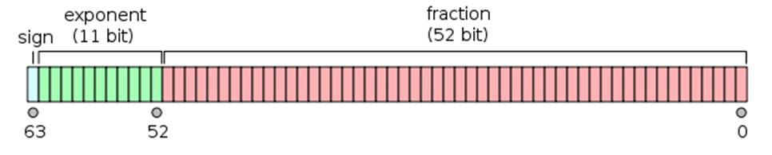

# Ինչպես մնացորդով թվերից ստանալ ամբողջ թիվ, և ինչ մեթոդներ կան ստուգելու արդյո՞ք թիվը ամբողջ է թե ոչ

Երբեմն լինում են խնդիրներ, երբ անհրաժեշտ է ստուգել ներմուծված թվային տվյալներն արդյոք ամբողջ թվեր են թե ոչ, որոշ դեպքերում նաև դրանք վերածել ամբողջ թվերի, եթե այդպիսին չեն։ **JavaScript**-ում դրա համար կան ներդրված մեթոդներ, բացի դրանից կան նաև մի շարք հետաքրքիր եղանակներ, որոնց նույնպես կանդրադառնամ։ Եվ այսպես,որպեսզի ստուգենք թիվը ամբողջ է թե ոչ, կարող ենք օգտագործել **Number.isInteger(n)** մեթոդը։ Այն վերադարձնում է _true_, եթե թիվն ամբողջ է, հակառակ դեպքում՝ _false_: Շատ լավ մեթոդ է իրականում, բայց ունի մի հատ բաց, որը բնականաբար կապված է մեր շատ սիրելի _«Internet Explorer»_ բրաուզերի հետ։ Դրա վրա այս մեթոդը չի աշխատում։ Կարող է լուծում լինել **_պոլիֆիլի_** օգտագործումը, փորձենք՝

```js
Number.isInteger =
  Number.isInteger ||
  function (value) {
    return (
      typeof value === "number" &&
      isFinite(value) &&
      Math.floor(value) === value
    );
  };
```

Այն ուղղակի ստուգում է, եթե _Number_ գլոբալ օբյեկտը ունի isInteger մեթոդը, ապա կանչում է այն, իսկ եթե տվյալ մեթոդը բացակայում է, ինչպես որ _Internet Explorer_-ի ռեալիզացիայի մեջ է, ապա կանչում է մեր ստեղծած անանուն ֆունկցիան, և նրան որպես արգումենտ տալիս է թիվը, որն ուզում ենք ստուգել։ Մեր ֆունկցիան նախ _typeof_ օպերատորի միջոցով ստուգում է, որ դա թիվ է, հետո _isFinite(n)_ մեթոդի միջոցով որ այն անվերջ _(infinity)_ չէ և _NaN_ չէ, ապա _Math.floor(n)_ ներդրված մեթոդի օգնությամբ կլորացնում է դեպի ներքև և համեմատում սկզբնական արժեքի հետ։ Եթե բոլոր երեք ստուգումների արժեքը վերադառնում է _true_, ապա ֆունկցիան նույնպես _true_ է վերադարձնում։

Հաջորդ տարբերակը՝

```js
n === parseInt(n, 10);
```

Այստեղ ուղղակի թիվը համեմատում ենք՝ _parseInt_ ներդրված մեթոդին այդ թիվը տալով որպես առաջին արգումենտ, իսկ որպես երկրորդ արգումենտ նշում ենք այն համակարգը, որով թիվը պատկերում ենք, մեր դեպքում՝ տասականը։

Եվս մի տարբերակ՝

```js
Number(n) === n && n % 1 === 0;
```

Այստեղ նույնպես ամեն ինչ պարզ է, ցանկացած ամբողջ թիվ եթե մնացորդով(%) բաժանենք 1-ի վրա, ապա արդյունքը պետք է լինի 0։ Վերը նշված մեթոդը կարելի է ավելի կարճ գրելաձևով ստանալ՝

```js
!(n % 1);
```

Այսինքն թիվը մնացորդով բաժանում է կատարվում 1-ի վրա, և արժեքը ժխտման օպերատորի օգնությամբ վերածվում բուլյանի։ Եթե թիվը ամբողջ է, ապա այդ բաժանման արժեքը լինում է 0, 0-ն _falsy_ արժեք է, և դրա ժխտումը բնականաբար վերադարձնում է _true_: Նախապես կարելի է _typeof_ օպերատորի միջոցով ստուգել, որ մուտքագրված տվյալը անպայման թիվ լինի, այդ դեպքում մեթոդը կարող է անթերի աշխատել։

Եվ ևս մի տարբերակ՝ այս անգամ օգտագործելով **բիթային | օպերատորը**․

```js
n === +n && n === (n | 0);
```

Այս տարբերակում նախ _n_-ը վերածում ենք թվի ունար + օպերատորի միջոցով, և եթե այն թիվ չլինի, կստանանք _false_, և արտահայտությունը այլևս չի շարունակվի։ Եթե _n_-ը այնուամենայնիվ թիվ է, ապա _(n | 0)_ ենթաարտահայտությունը վերադարձնում է այդ թվի միայն ամբողջ մասը, հետևաբար եթե թիվը ամբողջ թիվ չէ, _n === (n | 0)_ -ն վերադարձնում է _false_:

Այժմ դիտարկենք թե ինչպես կարել է մնացորդով թվից ստանալ ամբողջ թիվ։ **JavaScript**-ի դեռևս առաջին ստանդարտից գոյություն ունի _Math_ ներդրված օբյեկտի 3 մեթոդներ, որոնց օգնությամբ թիվը կլորացնում են, դրանք են՝

```js
Math.ceil(n);
Math.floor(n);
Math.round(n);
```

Կախված խնդրի բնույթից մենք կարող ենք օգտագործել այն մեթոդը, որը մեզ տվյալ պարագայում պետք է։ Նրանք թիվը կլորացնում են համապատասխանաբար դեպի վերին սահման, ներքին սահման և վերջինը՝ ինչպես որ մաթեմատիկայում ընդունված է՝ դեպի ամենամոտ ամբողջը։ Բացի այս 3 մեթոդից, **ES6** ստանդարտում ավելացել է ևս մեկ մեթոդ՝ _Math.trunc(n)_: Այն թվից դեն է նետում մնացորդը և վերադարձնում ամբողջ մասը, օրինակ՝

```js
Math.trunc(3, 25) === 3; // true
Math.trunc(3.75) === 3; // true
```

Հաջորդ մեթոդը՝ _parseInt(n, 10)_ - օգնությամբ։ Օրինակ՝

```js
parseInt(3.25, 10) === 3; // true
parseInt(3.75, 10) === 3; // true
```

Կարող ենք օգտագործել նաև **բիթային | օպերատորը**։ Օրինակ՝

```js
let num = 3.85 | 0; // 3
let anotherNum = 5.45 | 0; // 5
```

Բիթային **~ (tilde)** օպերատորը նույպես կարող է կիրառվել մնացորդով թվից ամբողջ մաս ստանալու համար։ Այն ուղղակի բիթային ոչ-ն է, և օգտագործվում է երկուական համակարգում աշխատելու համար։ Որպեսզի նրա աշխատանքի սկզբունքը պարզ լինի, բերեմ մի օրինակ․ _8_ թիվը երկուական համակարգում պատկերվում է որպես _1000_։ Երբ մենք այդ թվի նկատմամբ կիրառենք **~** օպերատորը, ապա այն քանի-որ ինչպես ասվեց բիթային ոչն է, բոլոր բիթերում _0_-ները կվերածի _1_-ի, իսկ _1_-երը՝ _0_-ների։ Եվ _8_ թիվը, որի երկուական պատկերը _1000_-ն է, կդառնա _0111_, այսինքն տասական համակարգի _7_-ը։ Սակայն պրոբլեմը կայանում է նրանում, որ **JavaScript**-ը որպեսզի կարողանա բացասական թվերը ներկայացնել երկուական համակարգով, օգտագործում է **two’s complement** միջոցը, այդ պատճառով էլ օրինակ _~7_-ը վերածվում է _-8_-ի։

Եվ այսպիսով թվից առաջ երկու անգամ օգտագործելով ~ օպերատորը, մենք դեն ենք նետում մնացորդը, և ստանում թվի ամբողջ մասը։ Օրինակ՝

```js
~~4.25 === 4; // true
~~4.85 === 4; // true
~~-7.45 === -7; // true
```
