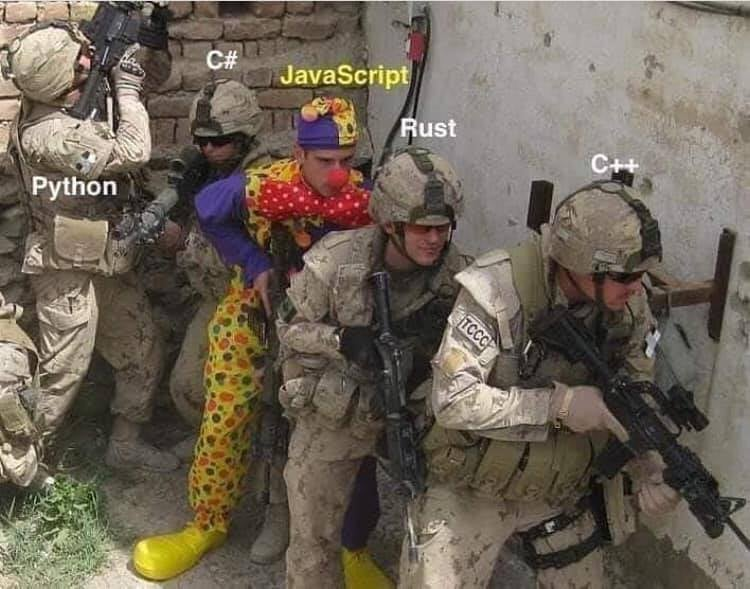

# Տրամաբանական վերագրման օպերատորները JavaScript-ում (Պաշտոնապես ընդգրկվել է ECMAScript 2021 կամ ինչպես հաճախ կարճ ասում են` ES12 ստանդարտ՝ 2021 թվ․ հունիս ամսին):

**JavaScript**-ում վերագրման օպերատորի հետ համակցված այլ օպերատորներ շատ հաճախ են կիրառվում։ Օրինակ եթե ունենք ինչ֊որ _number_ փոփոխական, որի արժեքը ենթադրենք 10 է, և մենք այն ուզում ենք մեծացնել 5֊ով, մենք կարող ենք գրել number = number + 5, և այժմ number փոփոխականը կունենա 15 արժեքը։ Սակայն նույն գործողությունն ընդունված է գրել ավելի համառոտ եղանակով՝ օգտվելով գումարման և վերագրման օպերատորների համակցումը հանդիսացող += օպերատորից։ Այսինքն 10 արժեքն ունեցող number փոփոխականը 5֊ով մեծացնելու համար կարելի է ուղղակի գրել number += 5:

Այս գրելաձևը լայնորեն օգտագործվում է նաև մյուս թվաբանական գործողությունների համար՝ -=, \*=, /=, %=, \*\*=: Բացի թվաբանական օպերացիաներից, այն կիրառելի է նաև բիթային օպերացիաների ժամանակ՝ &=, |=, ^=, <<=, >>=, >>>= : Սկսած _ES12_ ստանդարտից, հնարավոր է նաև տրամաբանական օպերատորները համակցել վերագրման օպերատորի հետ, և գրել ավելի համառոտ ու արտահայտիչ կոդ, եթե իհարկե չխճճվեք սիմվոլների մեջ:

Սկսենք տրամաբանական && օպերատորից։ Ինչպես գիտենք այս օպերատորը վերադարձնում է առաջին հանդիպած սխալ արժեքը, կամ եթե բոլոր արժեքները ճիշտ են, ապա ամենավերջինը։ (_Ինչպես հիշում ենք JavaScript-ում «սխալ» են համարվում 0, -0, 0n, null, undefined, false, '"", NaN արժեքները_)։

```js
let a = 10;
let b = 15;
a = a && b; // 15
```

a փոփոխականն ընդունել է 15 արժեքը, քանի֊որ ինչպես ասվեց, տրամաբանական && օպերատորը բոլոր օպերանդների ճիշտ լինելու դեպքում վերադարձնում է վերջին օպերանդի արժեքը։ Վերևի արտահայտությունը տրամաբանական և վերագրման օպերատորների համակցման միջոցով այժմ կարելի է գրել ավելի կարճ և արտահայտիչ եղանակով։

```js
a &&= b; // 15
```

`(a = a && b) և (a &&= b)` արտահայտությունները համարժեք են։

Մյուսը տրամանաբանական || օպերատորն է։ Այն ինչպես գիտենք վերադարձնում է առաջին ճիշտ արժեքը, իսկ եթե բոլոր արժեքները սխալ են, ապա վերջինը։

```js
let a = 10;
let b = 15;
a = a || b; // 10
```

Այս արտահայտությունը տրամաբանական վերագրման օպերատորի օգնությամբ կարելի է գրել հետևյալ համառոտ եղանակով՝

```js
a ||= b; // 10
```

Եվ վերջինը՝ տրամաբանական ?? օպերատորն է։ Այժմ օրինակի վրա տեսնենք, թե ինչպես է հնարավոր ?? և = օպերատորների համակցումը օգտագործել։

```js
const car = {
  color: "red",
};

car.color = car.color ?? "green";
console.log(car.color); // "red"
car.speed = car.speed ?? 250;
console.log(car.speed); // 250
```

?? տրամաբանական օպերատորը **JavaScript**-ում ավելացել է _ECMAScript 2020_ ստանդարտից սկսած (_ES11_), և եթե ծանոթ չեք նրա աշխատանքի նկարագրությանը՝ հայերենով մանրամասն կարող եք կարդալ պարբերության ներքևում տեղադրված հղումով։ Իսկ համառոտ եթե նկարագրենք՝ այն վերադարձնում է աջ օպերանդի արժեքը, եթե ձախ օպերանդի արժեքը null կամ undefined է, հակառակ դեպքում այն վերադարձնում է ձախ օպերանդի արժեքը։ ?? օպերատորի մասին կարող եք տեսնել [այս հղումով։](./Syntax%20and%20Use%20Cases%20of%20Nullish%20Coalescing.hy.md)

Վերոհիշյալ օրինակը տրամաբանական վերագրման օպերատորի օգնությամբ համառոտ կարելի է գրել հետևյալ եղանակով՝

```js
car.color ??= "green"; // "red"
car.speed ??= 250; // 250
```

_ECMAScript 2021_-ի նորամուծությունների մասին խոսելիս, նաև պետք է նշել, որ որևէ հեղափոխական կամ չափազանց կարևոր փոփոխություններ չկան։ Ավելի շուտ սինթաքսը «քաղցրացնող», ավելի համառոտ, բայց և հավասարաչափ ընթեռնելի կոդ ստանալուն միտված փոփոխություններ են, որոնց ծանոթանալ և առիթի դեպքում օգտագործել խրախուսվում է։
