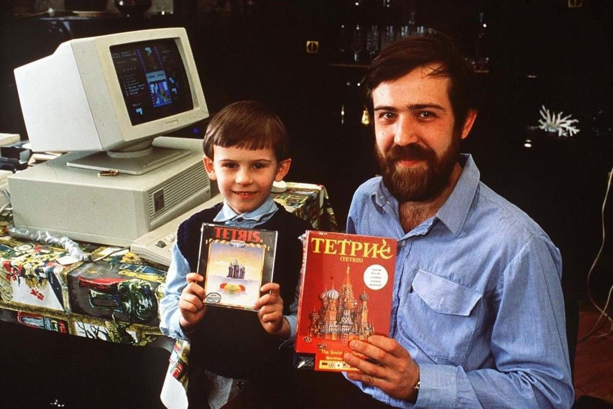

_Լուսանկարում «Տետրիս» խաղի ստեղծող Ալեքսեյ Լեոնիդովիչ Պաժիտնովն է որդու հետ_

# Աշխարհում ամենատարածված խաղերից մեկի՝ ՏԵՏՐԻՍԻ ստեղծման պատմությունը: Ի՞նչ կապ ունի ՀՀ նախկին նախագահ Արմեն Սարգսյանը Տետրիսի ստեղծման հետ։ Նաև կգտնեք հղումներ, որոնց օգնությամբ կարող եք JavaScript ծրագրավորման լեզվով ստեղծել Տետրիս և խաղալ:

Աշխարհահռչակ **Տետրիս** խաղը ստեղծվել է _1984_ թվականին՝ ԽՍՀՄ գիտությունների ակադեմիայի _Անատոլի Դորոդնիցինի_ անվան հաշվողական կենտրոնի գիտաշխատող **Ալեքսեյ Պաժիտնովի** կողմից։ Անվանումն առաջացել է **տետրամինո** (_տետրամինոն չորս քառակուսիներից բաղկացած երկրաչափական ֆիգուր է_) և _թենիս_ բառերից։ **Տետրիսի** առաջին տարբերակը գրվել է **Pascal** ծրագրավորման լեզվով՝ սովետական արտադրության _«Электроника-60»_ համակարգչի վրա։

Նորաստեղծ խաղը մեծ ճանաչում է գտնում Մոսկվայում, ապա արևելյան եվրոպայի նախկին սոցիալիստական հանրապետություններում։ Բրիտանական IT-ընկերություններից մեկը գնում է այդ խաղի թողարկման արտոնագիրը։ Սակայն իրավամբ Տետրիսը մեծ հանրաճանաչություն ձեռք է բերում 90-ականների սկզբին, երբ Ճապոնական աշխարհահռչակ **“Nintendo”** ընկերությունն է գնում խաղի թողարկման արտոնագիրը, և այն ներառում **"Nintendo Game Boy"** պորտատիվ խաղային կոնսոլների մեջ: Իր ստեղծած խաղի համար **Ալեքսեյ Պաժիտնովը** ստանում է անձնական համակարգիչ և համեստ վարձատրություն։ Եվ միայն _2007_ և հետո նաև _2009_ թվականին է նրա վաստակն ըստ արժանվույն գնահատվում, և Պաժիտնովն արժանանում է **Game Developers Choice Awards**-ի և **LARA — Der Deutsche Games Award**-ի պատվավոր մրցանակներին։

ՀՀ նախկին նախագահ _Արմեն Սարգսյանը_ Տետրիսի ճյուղավորումներից մեկի՝ **Wordtris**-ի համահեղինակներից է։ Խաղի նպատակն է կառուցել երեք և ավելի տառերից բաղկացած բառեր, օգտագործելով խաղադաշտի վերևից ընկնող սալիկները։ Բառերը կարող են դասավորված լինել հորիզոնական և ուղղահայաց, և եթե խաղացողին հաջողվի կառուցել "կախարդական բառը", ջրհորը կմաքրվի սալիկներից և խաղացողը կստանա մեծ բոնուս: _2018_ թվականին, լրագրողների հետ հանդիպումներից մեկի ժամանակ _Արմեն Սարգսյանը_ ներկայացրել էր խաղի ստեղծման նախապատմությունը։ Նա պատմել էր, որ իրենք զբաղվում էին գիտահետազոտական աշխատանքով` մաթեմատիկական մոդելավորմամբ, որից հետո պարզվել է, որ մոդելը, որն իրենք մշակել են, կարելի է կիրառել տարբեր ոլորտներում։ Որպես մոդելավորման պարզեցված տարբերակ՝ ստեղծվում է **Tetris-Wordtris** խաղը։ Սկզբում խաղի թողարկման իրավունքը ձեռք է բերում ամերիկյան **IBM** ընկերությունը, ապա նաև ճապոնական **Nintendo**-ն։ **Computer Gaming World** ամսագիրը (_ամբողջապես համակարգչային խաղերի և խաղային ինդուստրիայի լուսաբանմանը նվիրված առաջին ամսագրերից է, հրատարակվել է 1981 - 2006 թվ․_) գրում էր, որ **Wordtris**-ը էլ ավելի հետաքրքրիր, կլանող ու կախվածություն առաջացնող խաղ է, քան դասական տետրիսը։

[Այս հղումով](https://www.freecodecamp.org/news/learn-javascript-by-creating-a-tetris-game/?fbclid=IwAR07IBM3AxjTMbwu9TUR0TJkT50wkFyOV1Nku4IUOjL3NkxLTN-_DgiASkE) կարող եք ծանոթանալ **JavaScript** ծրագրավորման լեզվով Տետրիսի ստեղծման հետաքրքիր տարբերակի՝ մանրամասն բացատրություններով։

[Այստեղ](https://github.com/vontanne/javascript-tetris) մեկ այլ տարբերակի աղբյուրային կոդն է _github_-ից։ (_Ովքեր github-ից երբևէ չեն օգտվել, ուղղակի կարող են այդ հղումով մտնել, էջի վրա կտեսնեն կանաչ կոճակ, որի վրա գրված է Code: Անհրաժեշտ է քլիք անել այդ կոճակի վրա, և բացված մենյուից ընտրել Download ZIP տարբերակը: Ովքեր ծանոթ են, կարող են ուղղակի git clone անել, ուսումնասիրել, փոխել ըստ իրենց նախասիրության և օգտագործել, ոչ մի լիցենզիա չի պահանջվում, այն ամբողջապես ազատ է ցանկացած տեսակի օգտագործման համար։_):

[Իսկ սա տետրիսի պաշտոնական կայքն է](https://tetris.com/), այստեղ կարելի է օնլայն խաղալ տետրիս և հետևել տետրիսի հետ կապված բոլոր նորություններին:
