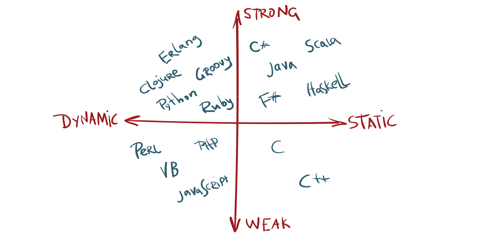

# Ի՞նչ ֆունդամենտալ տարբերություն կա դինամիկ և ստատիկ տիպավորում ունեցող ծրագրավորման լեզուների միջև: Ինչպե՞ս չշփոթել դինամիկ տիպավորումը՝ թույլ, իսկ ստատիկը՝ ուժեղ տիպավորման հետ: Եվ ինչպե՞ս օգտագործել տիպերի խիստ ստուգումը՝ JavaScript ծրագրավորման լեզվի մեջ:

Ինչպես գիտենք բոլոր ծրագրավորման լեզուներն ընդունված է բաժանել երկու խմբերի՝ տիպավորում ունեցող և չունեցող։ Տիպավորում ունեցող լեզուները կազմում են բացարձակ մեծամասնություն, օրինակ՝ C, C++, Java, C#, Python, PHP, Ruby, և իհարկե բոլորիս սիրելի JavaScript-ը։ Տիպավորում չունեցող լեզուներից են օրինակ Ասսեմբլերի լեզուն, Forth-ը, Brainfuck-ը։ Հակընդդեմ տարածված մտայնության, JavaScript-ը, ինչպես նաև մի շարք այլ ինտերպրետացվող լեզուներ, այո՛, ունեն տիպավորում։

Իրենց հերթին տիպավորում ունեցող ծրագրավորման լեզուները ևս բաժանվում են խմբերի՝ ստատիկ և դինամիկ, ուժեղ կամ թույլ տիպավորմամբ լեզուների (_Ուժեղի կամ թույլի փոխարեն հաճախ օգտագործում են խիստ և ոչ խիստ տիպավորում_)։

Ստատիկ տիպավորման դեպքում, փոփոխականը, ֆունկցիայի պարամետրերը և վերադարձրած արժեքը կապվում են որոշակի տիպի հետ՝ հենց դրանց հայտարարման ժամանակ։ Հետագայում այդ տիպերը փոփոխման ենթակա չեն։ Օրինակ ստատիկ տիպավորմամբ Java կամ C++ լեզուներում փոփոխական հայտարարելիս, ֆունկցիայի պարամետրերը և վերադարձվող արժեքը որոշելիս պետք է նշել դրանց տիպը։

```js
String userName = "John"
int myNumber = 999
```

Վերևի օրինակի մեջ հայտարարված userName և myNumber փոփոխականները կապված են որոշակի տիպերի հետ, մեր պարագայում՝ String և int (_integer` ամբողջ թիվ_) համապատասխանաբար։ Այսինքն եթե մենք այժմ ուզենանք userName փոփոխականին վերագրել ուրիշ տիպին պատկանող արժեք՝ ասենք թե Բուլյան true, ապա ծրագրի կոմպիլյացիայի ժամանակ կստանանք տիպավորման սխալ։ **Ստատիկ տիպավորմամբ** ծրագրավորման լեզուներից են բացի վերոնշյալներից, նաև C#-ը, Pascal-ը, Go-ն, Haskell-ը, Rust-ը, Matlab-ը և այլն։

**Դինամիկ տիպավորմամբ** ծրագրավորման լեզուներում փոփոխականը կապվում է տիպի հետ ոչ թե դրա հայտարարման, այլ վերագրման ժամանակ։ Այսինքն փոփոխականը ծրագրի տարբեր մասերում կարող է ընդունել տարբեր տիպերին պատկանող արժեքներ։ Օրինակ JavaScript-ում՝

```js
let userName = "John";
let myNumber = 999;
userName = true;
myNumber = "one";
```

Ինչպես տեսնում ենք userName փոփոխականին սկզբում վերագրվել էր String տիպին պատկանող արժեք, բայց հետո այն մենք փոխեցինք Բուլյան տիպի արժեքով։ Ինչքան էլ, որ դա տարօրինակ օպերացիա համարվի՝ ամեն դեպքում դինամիկ լեզուներն այդպես անել թույլ են տալիս։ Նույն կերպ myNumber փոփոխականի թվային տիպին պատկանող արժեքը փոխարինվում է String տիպին պատկանող արժեքով, և ֆորմալ առումով ոչ մի տիպավորման սխալ մենք չենք ունենում։

Բացի JavaScript-ից, դինամիկ տիպավորմամբ լեզուներ են նաև Python-ը, PHP-ին, Lisp-ը, Ruby-ն, Perl-ը և այլն։ Որոշ դինամիկ տիպավորմամբ լեզուներում հետագայում ստեղծվել է հնարավորություն օգտագործել նաև տիպերի խիստ ստուգում, մասնավորապես Python-ում սկսած 3․5 և PHP-ում՝ սկսած 7-րդ տարբերակից դա կարելի է անել ըստ ցանկության։

Մասնագիտական գրականության մեջ կամ ֆորումներում հաճախ թույլ տիպավորումն օգտագործվում է որպես դինամիկ, իսկ ուժեղ տիպավորումը՝ ստատիկ տիպավորման հոմանիշներ։ Սակայն պետք է ասել, որ իմաստային տարբերություններ նրանց միջև այնուամենայնիվ կա։

**Ուժեղ կամ ինչպես երբեմն անվանում են խիստ տիպավորմամբ լեզուներում** արգելվում է արտահայտության մեջ օպերացիաներ կատարել տարբեր տիպերին պատկանող արժեքների միջև՝ օգտվելով տիպերի անուղղակի վերափոխումներից։ Թույլ տիպավորմամբ լեզուներում այդպիսի սահմանափակումներ կամ չկան, կամ շատ քիչ են։ Ի տարբերություն դինամիկ և ստատիկ տիպավորման՝ ուժեղ և թույլ տիպավորումը բևեռացված չէ, այսինքն մենք կարող ենք ասել, որ տվյալ ծրագրավորման լեզուն ուժեղ կամ թույլ տիպավորում ունի համեմատած այս կամ այն լեզվի հետ։ Օրինակ PHP-ին ավելի ուժեղ տիպավորում ունի, քան JavaScript-ը, իր հերթին Python-ի տիպավորումն ավելի խիստ է, քան PHP-ինը, չնայած որ սրանք բոլորն էլ դինամիկ լեզուներ են։ Դիտարկենք օրինակով, և ամեն ինչ ավելի պարզ կլինի։

Դիցուք մենք ունենք ինչ-որ num փոփոխական, որի արժեքը պատկանում է թվային տիպի, և ինչ-որ str փոփոխական, որի արժեքը String տիպի է։ Եթե մենք փորձենք ուժեղ տիպավորմամբ լեզվում num-ին գումարել str ապա կստանանք սխալ, քանի-որ նրանք պատկանում են տարբեր տիպերի և անիմաստ է թվին գումարել ինչ-որ տեքստ։ Սա լիովին տրամաբանական է, և օրինակ Python-ում, որը հանդիսանում է դինամիկ, բայց ուժեղ տիպավորմամբ լեզու՝ այդ արտահայտությունը կհանգեցնի սխալի։

Մյուս կողմից եթե այդ արտահայտությունն օգտագործենք JavaScript-ի մեջ, որը հանդիսանում է դինամիկ և թույլ տիպավորմամբ լեզու, ոչ մի սխալ չի լինի։ Լեզվի ինտերպրետատորը հասկանալով, որ այդ օպերացիան անհեթեթություն է, քանի-որ ի՞նչ իմաստ կարող է ունենալ թվին տեքստ գումարելը, անուղղակիորեն թիվը վերածում է տեքստի, և թվաբանականի փոխարեն կատարում է տեքստի համակցման օպերացիա։ Այսինքն կարող ենք եզրակացնել, որ JavaScript-ը համեմատած Python-ի՝ ունի ավելի թույլ տիպավորում։

Բանավեճերը, թե ո՞ր տիպավորումն է ավելի գերադասելի՝ ստատիկ կամ դինամիկ, ուժեղ կամ թույլ, միշտ եղել են և կլինեն։ Պետք է նշել, որ ստատիկ տիպավորումը բավականին բարդացնում է ծրագրավորման լեզվի ուսումնասիրությունը, ինչպես նաև խիստ սահմանափակում է կոդ գրելիս ծրագրավորողի ազատությունը։ Այն նաև մեծացնում է գրվող կոդի ծավալը, դժվարացնում ընթեռնելիությունը, քանի-որ թե փոփոխականներ հայտարարելիս, թե ֆունկցիայի պարամետրեր և վերադարձվող արժեք որոշելիս, ամեն անգամ պետք է նշել դրանց տիպերը։

Դինամիկ լեզուներն ավելի թեթև են և սովորելու շեմը ավելի ցածր է, չնայած որ լեզվի կառուցվածքի մեջ խորանալու դեպքում այն կարող է նույնքան բարդ լինել, որքան որ ստատիկ տիպավորմամբ լեզուները։ Այդ դեպքում կարող է հարց առաջանալ, թե ի՞նչու են ծրագրավորողները սովորում ծանրքաշային ստատիկ լեզուներ։ Իսկ պատճառը նրա մեջ է, որ իրականում ժամանակ խնայելով լեզվի մակերեսային արագ յուրացման վրա, հետո մի քանի անգամ ավել ժամանակ է ծախսվում դինամիկ լեզուներով գրված ծրագրերի թեսթավորման և անխուսափելի սխալների ուղղման համար։

Ստատիկ և ուժեղ տիպավորում ունեցող լեզուներով գրված ծրագրերն ավելի լավ են օպտիմալացվում կոմպիլյատորների կողմից, հետևաբար նաև ավելի արագ են աշխատում (_JavaScript-ը հազվադեպ դինամիկ լեզուներից է, որ արագագործությամբ բավականին մոտ է ստատիկ տիպավորում ունեցող լեզուներին, և դա հիմնականում V8 և SpiderMonkey՝ սկսած JaegerMonkey մոդիֆիկացիայից, շարժիչներում կիրառվող JIT կոմպիլյացիայի, հիշողության կառավարման առաջավոր ալգորիթմերի ու գրագետ կազմակերպված տարբեր օպտիմիզացիաների համատեղման_)։ Քանի-որ փոփոխականների արժեքների տիպերը, ֆունկցիաների պարամետրերն ու վերադարձվող արժեքները նախապես արդեն որոշված են՝ մեծ նախագծերի դեպքում, երբ ծրագրի վրա աշխատում են տասնյակ ծրագրավորողներ և կոդը բաղկացած է հազարավոր տողերից, ավելի քիչ հավանական են թյուրիմացություններն ու տիպերի հետ առնչվող սխալները։ Ստատիկ տիպավորումը նաև թույլ է տալիս օգտագործել IDE-ների ամբողջ գործիքակազմը, կատարել կոդի ստատիկ վերլուծություն և գտնել որոշակի բնույթի սխալներ՝ մինչև կոմպիլյացիայի փուլ հասնելը։

Դինամիկ և թույլ տիպավորումն իր հերթին լեզվին տալիս է ծայրահեղ ճկունություն՝ չսահմանափակելով ծրագրավորողի գործողությունները խիստ շրջանակների մեջ։ Որոշ ծրագրավորողներ այն կարծիքին են, որ դինամիկ լեզուներն այնուամենայնիվ ավելի գերադասելի են, օրինակ **JavaScript: The Good Parts** և **How JavaScript Works** գրքերի հեղինակ **Դուգլաս Քրոքֆորդը** գրում է․ _«Աշխատանքի մեջ ես հասկացա, որ այն սխալները, որոնք հայտնաբերվում են տիպերի խիստ ստուգման դեպքում՝ ինձ ամենևին չեն անհանգստացնում։ Մյուս կողմից ես գտնում եմ, որ ազատ տիպավորումը լիբերալ է։ Ինձ պետք չէ ստեղծել դասերի բարդ հիերարխիա, և ես երբեք ստիպված չեմ վերափոխել կամ պայքարել տիպերի համակարգի դեմ, որպեսզի ստանամ այն վարքագիծը, որն ինձ անհրաժեշտ է»_։

Ամեն դեպքում՝ ոչ մեծ ծրագրեր գրելու կամ ծրագրի վրա փոքր խմբով աշխատելու ժամանակ նախապատվությունը պետք է տալ դինամիկ լեզուներին։ Սակայն շատերի կարծիքով բարդ նախագծերի և մեծ խմբերով աշխատելու պարագայում գերադասելի են ստատիկ տիպավորմամբ ծրագրավորման լեզուները։

**JavaScript** ծրագրավորման լեզուն ստեղծվել է հենց վեբի համար՝ HTML էլեմենտների հետ մանիպուլյացիաներ կատարելու նպատակով։ Կա երկու պատճառ, թե ինչու այն որոշվեց ստեղծել դինամիկ և թույլ տիպավորմամբ․

- Նախ՝ 90-ականներին վեբը շատ թույլ էր զարգացած, և առանձնապես շատ բան JavaScript-ից չէր էլ պահանջվում՝ ընդամենը մի փոքր դինամիկություն հաղորդել վեբ կայքերին։ JavaScript-ով գրված կոդը պարզ էր՝ առավելագույնը մի քանի տասնյակ տող, և բոլորովին իմաստ չկար կատարել տիպերի խիստ ստուգում։
- Երկրորդ պատճառն այն էր, որ լեզուն պետք էր հնարավորինս հեշտ լիներ, որպեսզի կայքեր պատրաստող վեբ դիզայներները արագ յուրացնեյին այն։ Այսինքն խնդիր էր դրված ստեղծել ծրագրավորման լեզու՝ ոչ ծրագրավորողների համար, ինչը և հաջողությամբ իրագործվեց։

Վեբի աննախադեպ զարգացումը բերեց նրան, որ սկզբնապես պրիմիտիվ ծրագրավորման լեզուն շատ արագ վերածվեց բարդ և հզոր լիարժեք լեզվի, որը կարելի օգտագործել ոչ միայն վեբում, այլև ծրագրավորման գրեթե բոլոր բնագավառներում։ JavaScript-ով ստեղծվող ծրագրերը գնալով մեծացան, բարդացան, և անհրաժեշտություն առաջացավ ստեղծել տիպերի խիստ ստուգում։

Այդ խնդրի լուծման համար Microsoft ընկերությունում ստեղծվեց [TypeScript](https://www.typescriptlang.org/) ծրագրավորման լեզուն, որն իրականում հանդիսանում է JavaScript-ի դիալեկտը։ Ի դեպ այն ընդգծված նմանություն ունի նաև C#-ի հետ, որը նույնպես ստեղծվել է Microsoft ընկերության կողմից։ TypeScript-ում փոփոխական հայտարարելիս, ֆունկցիայի պարամետրեր և վերադարձվող արժեք որոշելիս համապատասխան տվյալի տիպը նշվում է։ Օրինակ՝

```js
let userName: string = "John";
```

Մեր userName փոփոխականն այժմ կարող է ստանալ միայն String տիպին պատկանող արժեքներ։ Փոփոխականը ստեղծելիս մենք հստակորեն այն կապել ենք String տիպի հետ։

Իր հերթին Facebook-ը նույնպես առաջարկեց JavaScript-ում տիպերի խիստ ստուգման գործիք՝ [Flow](https://flow.org/) գրադարանը։ Այն նույնպես թույլ է տալիս փոփոխականների, պարամետրերի և ֆունկցիայի վերադարձվող արժեքի համար հստակ սահմանել նրա տիպը։

Github-ում վերջին դիտարկումները ցույց են տալիս [TypeScript-ի](https://www.typescriptlang.org/) հանրաճանաչության սրընթաց աճ։ Հատկապես Angular և Nest ֆրեյմվորքներով աշխատելիս, ավելի ու ավելի շատ ծրագրավորողներ են սկսել նախապատվությունը տալ TypeScript-ին։ Նույն կերպ React գրադարանով աշխատելիս, մեծ նախագծերի համար ակտիվորեն օգտագործվում է թե՛ Flow-ի գործիքակազմը և թե՛ TypeScript-ը։
