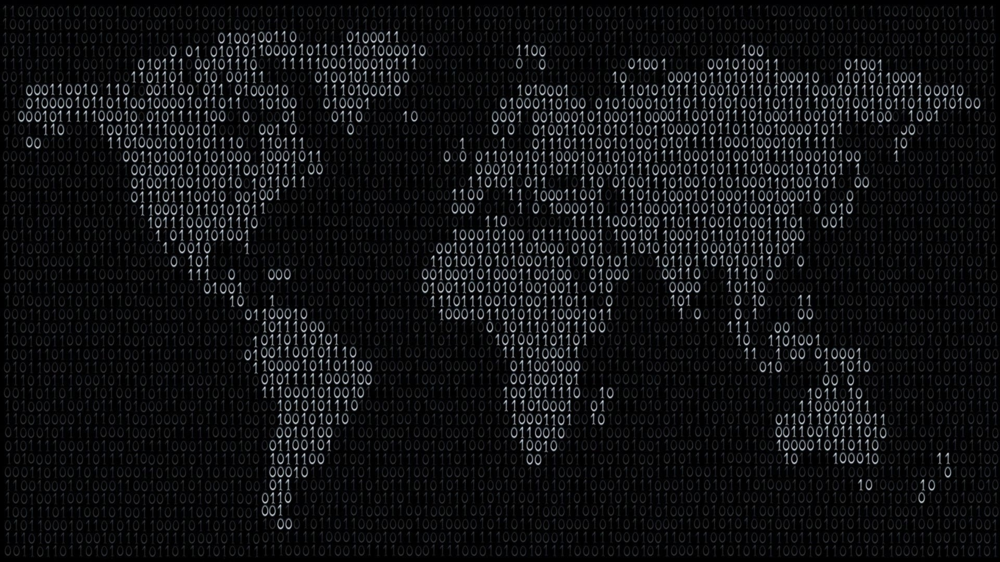

# JavaScript… Ամենաէլեգանտ և միաժամանակ ամենաթերագնահատված լեզուն

**JavaScript**-ը ներկայումս ամենաքննարկվող ու ամենահանրաճանաչ ծրագրավորման լեզուներից է։ Ծրագրավորողների կեսն ատում է այս լեզուն, ծաղրում նրանում առկա «տարօրինակությունները», իսկ մյուս կեսը գտնում է, որ այն էլեգանտ, ինտուիտիվ հասկանալի ու պարզ կառուցվածք ունի: Նույնիսկ _Minecraft_-ի ստեղծող _Markus Persson_-ը կատակով սահմանել էր մի աքսիոմ համաձայն որի, եթե որևէ բան հնարավոր է գրել **JavaScript**-ի միջոցով, ապա այն կգրվի **JavaScript**-ի միջոցով։ Այժմ փորձենք հասկանալ, որտեղից է գալիս տեսակետների նման հակասական, իրարամերժ բախումը:

## JavaScript-ի ստեղծման և զարգացման պատմությունը

Հեռավոր 1995 թվականին կայքերը շատ պարզ կառուցվածք ունեին և ուղղակի հանդիսանում էին այն, ինչ այսօր ընդունված է անվանել կայք-այցեքարտ, ընդ որում, էլ ավելի պրիմիտիվ տարբերակով, առանց լուրջ գրաֆիկական լուծումների և անիմացիայի։ **Netscape Communications Corporation** ընկերությունը ստեղծեց _Mosaic_ բրաուզերը, որը համարվում է աշխարհում առաջին բրաուզերը (_նախագծի ղեկավար՝ Marc Andreessen_): Հենց _Mosaic_-ի հիմքի վրա հետագայում թողարկվեց **Netscape Navigator**-ը՝ _Internet Explorer_-ի հիմնական մրցակիցը։ **Netscape Communications** ընկերությունում 1995 թ. ապրիլին աշխատանքի ընդունեցին **Brendan Eich**-ին (_Բրենդան Այք_), ով էլ շուտով դառնալու էր **JavaScript** լեզվի հիմնադիրը: Այստեղ նրան առաջադրեցին խնդիր. ստեղծել լեզու, որով հնարավոր կլինի ազատորեն մանիպուլիացիաներ անել _DOM_-ի հետ, որի արդյունքում կայքերին հնարավոր կլինի հաղորդել դինամիկություն ու ինտերակտիվություն։

Ամենասկզբում **Brendan Eich**-ը ցանկանում էր ստեղծել ֆունկցիոնալ լեզու, ինչպես ինքն էր նշում հարցազրույցներից մեկում` տեղադրել _Scheme_-ը (_Lisp լեզվի դիալեկտներից է_) բրաուզերում։ Իր բլոգում նա գրում է, որ գործնեության մեծ ազատություն նա, ցավոք, չուներ և տեխնիկական բաժնի ղեկավարները պայման դրեցին նրա առաջ, որ լեզուն լինի օբյեկտ կողմնորոշված և հնարավորինս մոտ _Java_-ին՝ գոնե սինթաքսով։ Այդ ժամանակներում **OOP**-ն համարվում էր բոլոր պրոբլեմների համար լավագույն լուծումը, իսկ օբյեկտ կողմնորոշված _Java_ լեզուն նոր էր ստեղծվել և հանդիսանում էր էտալոն, որպես ճիշտ ու գրագետ ճարտարապետական լուծումներ ունեցող լեզու։ Ասում են **Eich**-ը լեզուն ստեղծեց 10 օրում, որն իհարկե այդքան կարճ ժամանակում չէր կարող թերություններից զուրկ լինել։ Սկզբից այն անվանեցին **Mocha**, հետո **LiveScript** և վերջում կանգ առան **JavaScript** անվանման վրա։ **JavaScript** անվանումն ավելի շուտ մարկետինգային քայլ էր և նպատակ ուներ լեզվին շուկայում դիրքավորել որպես _Java_ լեզվի դինամիկ-ինտերպրետացվող տարբերակ։ Ընդհանրություն չունենալով _Java_-ի հետ, անվանումը մինչև հիմա շփոթեցնում է սկսնակներին։

Հետագայում **Eich**-ն իր բլոգում գրում է, որ _Java_-ից վերցրած լեզվական կառուցվածքները հիմնականում բացասական դեր խաղացին լեզվի զարգացման գործում, փոխարենը նա երջանիկ է _Scheme_ ֆունկցիոնալ լեզվից փոխառած առաջին դասի ֆունկցիաների (_first-class functions_) գաղափարի և _Self_ օբյեկտ կողմնորոշված լեզվից նախատիպերի կոնցեպտի (_prototypes_) ներդրման համար։ Քանի որ _Java_ և _JavaScript_ ապրանքային նշանները պատկանում էին **Sun Microsystems** ընկերությանը (_ներկայումս Oracle-ին_), ապա _Microsoft_ ընկերությունը չկարողացավ օգտագործել **JavaScript** անվանումը և լեզվի սեփական իրականացումն անվանեց **JScript**:

Ինչպես արդեն նշեցի, լեզուն ստեղծվել էր _DOM_ էլեմենտների հետ մանիպուլյացիայի և կայքերը դինամիկ դարձնելու համար և, բնականաբար, սկզբնական տարբերակում այն չափազանց ‹‹թեթև քաշային›› և պարզ լեզու էր հանդիսանում: Այդ էր պատճառը, որ այն երկար ժամանակ չէր զարգանում։ 1997 թվականին **ECMA international** ինֆորմացիոն և հաղորդակցական տեխնոլոգիաների ստանդարտիզացման կազմակերպությունում գրանցվեց **JavaScript** լեզվի ստանդարտը, իսկ **Sun Microsystems**-ի հետ անվան խնդիրներից խուսափելու համար լեզվական ստանդարտը անվանվեց **ECMA-262**։ Մեծ փոփոխությունները սկսվեցին, երբ հայտնվեցին _JSON-ը_, _AJAX_-ը և կրոս-բրաուզերային տարբեր լուծումները։ Զարգացմանը շատ մեծ թափ հաղորդեց _jQuery_ գրադարանի ի հայտ գալը։ Հետագայում _HTML5_-ը և _CSS3_-ը բրաուզերներից համարյա թե դուրս մղեցին _Flash_-ը և **JavaScript**-ի տրամադրության տակ հայտնվեցին այնպիսի տեխնոլոգիաներ, ինչպիսիք են՝ _Canvas_, _WebGL_, _WebSockets_, _WebWorkers_, _Audio_, _Video_ և այլն։

## Երբ խաղին միացավ Google-ը

**Google**-ը նոր շունչ տվեց **JavaScript**-ին՝ ստեղծելով **V8 engine**-ը, որի արագագործության շնորհիվ **JavaScript**-ը երբեմն մրցում է նույնիսկ կոմպիլացվող լեզուների հետ։ **V8**-ի հիմքի վրա _Ryan Dahl_-ը ստեղծեց **Node.js**-ը, որը հնարավորություն տվեց **JavaScript**-ին աշխատել սերվերում։ Օգտագործվող _libuv_ գրադարանը _V8_-ի հետ մեկտեղ հնարավորություն տվեց _backend_ ծրագրավորողներին արագորեն կիրառել **Node.js**-ը ծանրաբեռնված համակարգերի ստեղծման համար։ Արդյունքում սկսվեց նոր էկոհամակարգի գոյացումը, ստեղծվեց **MongoDB-ին** (_տվյալները պահում է BSON տեսքով, binary JSON_), որը շատ դեպքերում հիանալի ալտերնատիվ է ռելացիոն մոդելով աշխատող տվյալների բազաների համակարգերին։ Կլիենտ հատվածում ստեղծվեց գրադարանների ու ֆրեյմվորկների մեծ եռյակը _(Angular/React/Vue)_, որոնք էլ ավելի նպաստեցին **JavaScript**-ի տարածմանը ծրագրավորողների շրջանակներում, իսկ _ES5_ տարբերակից սկսած, երբ խիստ ռեժիմի _(strict mode)_ ներդրումով հնարավոր եղավ ուղղել մի շարք բագեր, ինչպես նաև ավելացվեցին որոշ ֆունկցիոնալ հնարավորություններ, այն կամաց-կամաց սկսվեց ընկալվել իբրև կայացած ու լուրջ ծրագրավորման լեզու։ Արդեն _ES6_-ում կատարվեցին այնպիսի մեծաքանակ նորամուծություններ, որ լեզուն այլևս նման չէր **Eich**-ի սկզբնական ստեղծագործությանը։

Լեզվի զարգացման վրա արդեն երկար տարիներ աշխատում են խոշոր ընկերությունների _(Google, Microsoft, Mozilla, Apple, Facebook և այլն)_ պրոֆեսիոնալ թիմեր, ինչպես նաև լեզվի շատ մեծ համայնքի շարքային ներկայացուցիչներ, ովքեր ամեն տարի _TC39_-ին ներկայացնում են լեզվի զարգացմանն ուղղված մեծ քանակությամբ առաջարկություններ ու հայեցակարգեր։ Սկսած 2015 թվականից ամեն տարի թարմացվում է լեզվի ստանդարտը, ավելանում են նոր հնարավորություններ: Առհասարակ, ներկայումս **JavaScript**-ն ամենաարագ զարգացող ծրագրավորման լեզուներից է։ Լեզուն թերևս զուրկ չէ թերություններից, սակայն թերագնահատողների մեծ զանգված չի խորանում լեզվի զարգացման դինամիկայի մեջ։ Թերագնահատելու մակերեսային պատճառներից է նաև լեզվի պարզությունը սկսնակների համար։ Բազմաթիվ սկսնակ ծրագրավորողներ արագորեն տիրապետում են լեզվի հիմնական կանոններին ու թողարկում բազմաթիվ նոր ծրագրեր՝ առանց անհանգստանալու ֆունդամենտալ խնդիրների մասին։ Արդյունքում շուկայում կուտակվում են անորակ ծրագրեր, որոնց ետևում կանգնած են մեծաքանակ թերուս ծրագրավորողներ։

**JavaScript**-ում ներդրված որոշ կոնցեպտներ, օրինակ՝ _prototype_-ժառանգումը, երբեմն ավելի արդյունավետ լուծում է, քան դասական _class_-ժառանգումը։ **JavaScript**-ն ունի իր փիլիսոփայությունը, որն անհրաժեշտ է ըմբոշխնել նորովի, այլ ոչ թե համեմատել դասական լեզուների հետ։ Հակառակ դեպքում առաջանում են կոնֆլիկտային զգացողություններ, մասնավորապես՝ _this_-ի վարքագիծը հասկանալու ընթացքում։ Նման կոնֆլիկտային զգացողությունների հետևանքով սովորաբար մեղադրում են հենց լեզվին, որի արդյունքում տարածվում է մեծ թյուրըմբռնում էլեգանտ և ճկուն լեզվի իրական բնույթի մասին։

Վերջում իհարկե տեղին կլինի մեջբերել **C++** ծրագրավորման լեզվի ստեղծող **Bjarne Stroustrup**-ի հայտնի միտքը, որտեղ նա ծրագրավորման լեզուները բաժանում է երկու խմբի՝ **լեզուներ, որոնցից բոլորը դժգոհում են և լեզուներ, որոնք ոչ ոք չի օգտագործում**։

[Follow me on Medium](https://medium.com/@vontanne)
